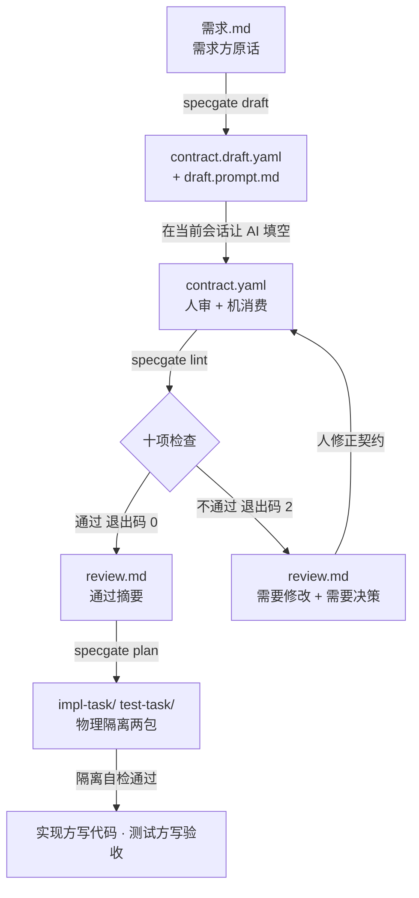

# specgate 上手指南：从需求到可验收交付

> 一份面向「从需求出发、从头开发」场景的文档。
> 如果你手里只有一句话需求、不懂代码细节，却想让交付「可被机器自动验收」，
> 这份指南告诉你：specgate 是怎么想、怎么用、能达到什么效果。

---

## 0. 这份文档给谁看

- **需求方 / 产品**：不读代码，但要把「要什么」说清楚。
- **实现开发者**：拿到一份机器能验的契约，去写代码、写测试。
- **评审者**：用 `lint` 的输出判断这份契约「够不够格进实现」。

你不需要先理解算法。照着第 3 节的 6 步走，就能跑通整个流程。

---

## 1. specgate 是什么

**specgate 是一个纯确定性、零模型参与的 CLI 门禁。**

它做一件事：把「提需求的人（不读代码）」的需求，转成一份「人能审、机器能消费」的
**验收契约（YAML）**，并判定契约里每条验收条件**是否能被机械判定**。契约不合格，不许进入实现阶段。

它**不生成代码、不判断需求合理性**——只回答一个问题：*「这条验收，机器到底验不验得了？」*

### 为什么需要它

需求方常写出这样的验收条件：

> 「登录界面要**友好**」「响应要**快**」「结果要**稳定**」

这些词机器验不了。可一旦它们混进实现，就变成了「上线后靠人肉感觉对不对」。
specgate 在**写代码之前**就把这类条件拦下来，逼需求方改成可测的写法：

> 「错误码等于 `E1001`，且文案为「用户名或密码错误」」

---

## 2. 整体实现逻辑（核心思想）

### 2.1 三条不可破的立场

| # | 立场 | 含义 |
|---|------|------|
| ① | **lint 纯确定性** | 不调任何模型；词表 / 正则 / 映射表全部写死在源码或 `constraints.yaml`。同样的输入永远同样的输出。 |
| ② | **误报比漏报严重** | 宁可少拦，勿误报。判定不可判定 = 命中主观词 **且** 无可测量锚点（带上下文排除兜底）。 |
| ③ | **工具不替人决策** | 把「该不该破例」变成需人签字的条目（`breaks.approved` / `assumed_output`）。 |

### 2.2 数据流：三阶段门禁



- **draft**：给空白契约 + 填写提示词（不调模型，提示词交给你的 AI 会话去填）。
- **lint**：十项检查，产出 `review.md`（人读）并给退出码（机器读）。
- **plan**：把契约拆成「实现方包」和「测试方包」两个**物理隔离**的目录，并做隔离自检。

### 2.3 十项检查与三层分层

检查按**「判定确定性程度」**分三层（不是按重要程度）：

| # | 检查 | 分层 | 影响退出码 |
|---|------|------|-----------|
| ① | 结构合法（必填字段 / id 唯一 / approved 三值 / out_of_scope 非空 / example.kind / states 枚举） | 阻塞 | ✔ |
| ② | verify 合法（取值来自 `constraints.yaml`，否则 builtin 并标注） | 阻塞 | ✔ |
| ③ | 措辞可判定性（判据一） | 阻塞 | ✔ |
| ④ | breaks 已批准（approved 三值校验） | 阻塞 | ✔ |
| ⑤ | manual 占比 ≤ 20% | 阻塞 | ✔ |
| ⑥ | invariants 有效（判据二） | 阻塞 | ✔ |
| ⑦ | 计算类条目必须有不变量 | 阻塞 | ✔ |
| ⑧ | 期望值已确认（assumed_output 归「决策」非「修改」） | 阻塞 | ✔ |
| ⑨ | 能力边界（when+then 拼接匹配） | 提醒 | ✘ |
| ⑩ | 接口状态覆盖（uses.api 非空才查） | 提醒 | ✘ |

> ⑨⑩ 是「人比机器更懂」的部分（某些交互能力 / 接口异常态只有作者清楚），所以**只提醒、不阻塞**——
> 工具诚实地把判断权交还给人。

### 2.4 两个核心判据（算法直觉）

**判据一 · 措辞可判定性（检查③，两级化）**
最终拦下 = `（suspect: true 且无锚点）` **或** `（命中主观词表 且无锚点）`。

- **第一级 `suspect`**（起草时由 AI 标注）：AI 逐条判断「测试方能不能据此写出断言」，不能→`suspect: true`，能→`suspect: false`。**lint 只读不判、不调模型**；同一份契约跑一百次输出完全相同。关键是**单向权力**：`suspect: true` 让门禁更严（兜住词表漏掉的说法），`suspect: false` 不放行任何东西（词表层照常跑），未声明则与改动前完全一致。
- **第二级词表层**：原有兜底层（如「友好 / 稳定 / 流畅 / 美观」），不可关闭。
- **锚点补全优先级高于主观词表**（误报会摧毁信任）：本次补了中文直角引号「」『』、布尔词（重定向到/移除/加入/包含于/位于）、顺序·集合类（倒序/升序/降序/排序/置顶/置底/去重）。带**上下文排除**避免误报：像「快照在 200ms 内」「清晰度不低于 90%」「正常流程返回 200」这类虽含敏感词但有锚点 / 属正常态，一律放行。

**判据二 · 蜕变关系有效性（检查⑥）**
计算 / 聚合类条目必须写清「输入变了，输出该怎么变」。算法：在**变动词**
（新增 / 删除 / 扩大 / 打乱 / 交换…）之后看 `tail`，**遍历所有切分点**，存在一种切法成立即通过。
若把**恒真词**（是数字 / 不为空 / 不报错…）放在输出侧，等于废话 → **阻塞**，并给出五类句式供照抄。

### 2.5 模块职责（实现者视角）

```
src/cli.js            位置参数分发 + 退出码 0/2/1
src/checks.js         十项检查编排 + 三层划分 + 终端/review.md 渲染（含 validateStructure）
src/constraints.js    verify_tools 加载（builtin 兜底，标 builtin；源码不硬编码枚举）
src/criteria/wording.js   判据一
src/criteria/invariant.js 判据二 + 能力边界 + 状态覆盖
src/suggestions.js    verify→建议映射（§5.2，绝不自动应用）
src/draft.js          模板 + 提示词生成
src/plan.js           两任务包 + 隔离自检
src/words.js          主观词表 / 变动词 / 关系词 / 恒真词 / verify→建议映射表（全部原样写死）
templates/            契约模板、draft/test 提示词、verify-tools 说明
```

---

## 3. 从需求到交付：完整工作流（6 步）

> 以「做一个登录功能」为例。所有命令在 `specgate/` 目录下运行，Node 22+。

### Step 1 · 起草（draft）

把需求原文存成 `requirement.md`，运行：

```bash
specgate draft requirement.md
```

产出两个文件：

- `contract.draft.yaml` —— 空白契约模板（带字段注释）
- `draft.prompt.md` —— 填写提示词（已注入你的需求原文 + verify 清单 + 禁编数值告知 + 蜕变关系正反例）

> 想直接看一份填好的完整样例？仓库里已带：`examples/req-login.md`（需求原文）+
> `examples/contract-login-ok.yaml`（通过 lint 的契约）。可对照 Step 3 直接 `specgate lint examples/contract-login-ok.yaml` 看通过效果。

### Step 2 · 让 AI 填空（在当前会话，不调模型）

把 `draft.prompt.md` 交给**你当前会话里的 AI**，让它按提示把契约填好，得到 `contract.yaml`。
这一步用模型，但 specgate 本身不参与——`draft` 只负责生成提示词。

### Step 3 · 门禁（lint）

```bash
specgate lint contract.yaml
```

- **通过** → 退出码 `0`，终端给出摘要，`review.md` 记录通过情况。
- **不通过** → 退出码 `2`，`review.md` 分两层列出问题：
  - **需要修改**：机器已判定不合格（如措辞不可判定、manual 超 20%、不变量恒真）。
  - **需要你决策**：机器不确定，要人签字（如 breaks 待审批、assumed_output 待确认）。

### Step 4 · 按 review.md 修正

例：`review.md` 指出 `A1` 的 then 不可判定：

```diff
- then: 登录界面要友好
+ then: 错误码等于 E1001，且文案为「用户名或密码错误」
```

改完重跑 `lint`，直到退出码 `0`。

### Step 5 · 物理隔离（plan）

```bash
specgate plan contract.yaml
```

产出两个**目录**（默认 `specgate-plan/`）：

```
specgate-plan/
  impl-task/    contract.yaml + context.md（代码库上下文，实现方填）
  test-task/    contract.yaml + verify-tools.md + prompt.md
```

**隔离自检**：从 `impl-task/context.md` 提取源码文件路径，在 `test-task` 全部文件里搜，
命中即失败（退出码 2）。`context.md` 只在首次生成，已存在则保留——
实现方填完真实路径后**重跑 `plan`** 才做隔离自检，确保测试方拿不到实现细节。

### Step 6 · 实现方与测试方并行

- 实现方看 `impl-task/contract.yaml` + 自己填的 `context.md` 写代码。
- 测试方看 `test-task/contract.yaml` + `verify-tools.md`，按 `verify` 取值选工具写验收。
- 两包物理隔离，测试方无法「偷看」实现，验收更可信。

### 退出码速查

| 退出码 | 含义 | 下一步 |
|--------|------|--------|
| `0` | 通过（含仅提醒项） | 可 `plan` 进实现 |
| `2` | 不通过 / 隔离泄漏 | 看 `review.md` 改契约 |
| `1` | 用法 / IO 错误 | 检查文件路径、YAML 格式 |

---

## 4. 契约怎么写（字段速查 + 正反例）

### 4.1 字段速查

| 字段 | 必填 | 说明 |
|------|------|------|
| `contract` | ✔ | 全局唯一短标识 |
| `intent` | ✔ | 需求方原话，不改写不美化 |
| `accept[]` | ✔ | 验收条件，≥1 条；每条含 `id / given / when / then / verify` |
| `accept[].invariants` | 计算类必填 | 输入变了输出怎么变（判据二）；其余可选 |
| `accept[].example` | 可选 | 写了就要 `positive / negative` 成对；`input`/`output` 必填 |
| `accept[].assumed_output` | 可选 | AI 推测的期望值登记处 → 归「决策」 |
| `uses.api` | 可选 | 非空触发「接口状态覆盖」检查 |
| `breaks[]` | 可选 | 打破的约定；每条 `what / why / approved`（true/false/null） |
| `out_of_scope` | ✔ | 明确不在范围内，不许空 |
| `states` | 可选 | 仅六个枚举：`empty / partial / forbidden / error / loading / race` |

### 4.2 verify 九种取值（来自 `constraints.yaml`）

| verify | 含义 | 适用 |
|--------|------|------|
| `type` | 类型系统能保证 | 类型层面的不变式 |
| `unit` | 单元测试（vitest） | 纯函数 / 逻辑 |
| `contract-test` | 接口契约测试 | 基准来自接口定义 |
| `geo` | 视觉数值卡尺 | 同结构精确比对几何 / 样式计算值 |
| `ax` | 语义指纹比对 | 跨组件库，角色+文案锚点、坐标差值度量 |
| `unit-visual` | 交互单元+文本骨架比对 | 页面缺语义角色标注时 |
| `trace` | 交互状态迁移等价性 | 状态机类行为 |
| `state-matrix` | 接口状态矩阵 | 拦截改写响应造空/null/4xx/5xx/慢响应 |
| `manual` | 人工验收 | 只能人验的，**占比 ≤ 20%** |

> 找不到 `constraints.yaml` 时用内置默认，lint 输出会标注「builtin」——
> 此时 verify 清单可能与项目真实能力不符，建议放一份 `constraints.yaml`。

### 4.3 措辞正反例（判据一，两级化）

**第二级词表层**（命中主观词且无锚点 → 拦）：

| 不可判定（会被拦） | 可判定（放行） |
|-------------------|----------------|
| 界面要**友好** | 错误码等于 `E1001` |
| 响应要**快** | 快照在 `200ms` 内生成 |
| 结果要**稳定** | 正常流程返回 `200` |
| 交互**流畅** | loading 态显示骨架屏 |
| 页面**美观** | 视觉度量差异不超过 `1px` |

**第一级 suspect**（不在词表里，但 AI 标 `suspect: true` 且无锚点 → 拦；不标则放行，向后兼容）：

| `suspect: true` 拦下（词表漏掉的说法） | 同句 `suspect: false` / 不标 → 放行 |
|-------------------|----------------|
| 别让用户等太久 | —— |
| 体感上不卡顿 | —— |
| 视觉呈现符合设计意图 | —— |
| Die Ladezeit soll kurz sein（外语） | —— |

**锚点补全**让「无数值但可判定」的句子不再被冤枉（误报必须为 0）：

| 可判定（放行，靠新锚点） | 命中锚点 |
|-------------------|----------------|
| 列表按创建时间**倒序**排列 | 顺序类（倒序） |
| 未登录时**重定向到**登录页 | 布尔词（重定向到） |
| 删除后该行从列表中**移除** | 布尔词（移除） |
| 顶部统计显示「待处理 5」 | 中文直角引号「」 |
| 接口返回 **500** 时展示错误提示 | 状态码 500 |
| 按钮处于 **disabled** 状态 | 状态名 disabled |

### 4.4 蜕变关系正反例（判据二）

有效（遍历切分点成立即通过）：

- 增量：新增一件商品后，总价严格增加
- 幂等：相同入参连续调用两次，结果完全相同
- 单调：范围扩大后，结果不减少
- 可加：按维度拆分后，各组之和等于总数
- 对称：输入顺序打乱后，结果一致

恒真（放输出侧即废话 → 阻塞）：

- ✗ 新增商品后总价**必须是数字**
- ✗ 重复调用**不报错**
- ✗ 删除一项后，结果**不为空**

---

## 5. 能达到什么效果（实测）

用自造样本集实测（非文档自带），判据一两级化按 A/B/C/D 四类分开报：

| 类 | 样本 | 拦下 / 误报 | 结论 |
|----|------|------------|------|
| A 词表内主观词（suspect 不声明） | 3 | 拦下 3 | PASS |
| B 词表外中文（suspect: true） | 6 | 拦下 6；未声明时放行 6 | PASS |
| C 外语（suspect: true） | 3 | 拦下 3 | PASS |
| D 无数值但可判定（误报测试） | 6 | 误报 0（必须为 0） | PASS |

> 原「漏报 0/16」只用了词表内的词，属自证，已作废。判据二（蜕变关系）本次未改动：样本 23，误报 0、漏报 0。

### 为什么稳

- **误报比漏报严重**：判定不可判定必须「主观词 + 无锚点」双命中，且带上下文排除（快照 / 慢查询 / 清晰度 / 正常态…），避免把本可验的条件误杀。
- **判据二遍历所有切分点**：只要存在一种切法成立就通过，不漏判有效蜕变关系；恒真词在输出侧直接判废话。
- **确定性可复现**：同一契约无论跑多少次，`review.md` 与退出码一致，可作为 CI 门禁。

### 门禁价值

在**写代码之前**就把「友好 / 稳定 / 流畅」这类不可验条件挡下，迫使需求方在成本最低时把验收写清楚——
后续实现与测试不再依赖「上线后靠人肉感觉」。

---

## 6. 怎么扩展

- **改 verify 清单**：编辑 `constraints.yaml` 的 `verify_tools`（增删工具、改 `manual.max_ratio`），不必动代码。
- **改词表 / 映射表**：主观词、变动词、关系词、恒真词、verify→建议映射全部在 `src/words.js`，原样可改。
- **产出位置**：`draft` / `plan` 默认写当前工作目录；`plan` 支持第二个参数指定输出根目录（便于隔离测试 / 集成）。

---

## 7. 常见问题

**Q：lint 报「约束源：builtin」是什么？**
A：没找到 `constraints.yaml`，用了内置 verify 清单。建议放一份项目级 `constraints.yaml`。

**Q：退出码 1 和 2 区别？**
A：`1` = 用法 / IO 错误（文件不存在、YAML 解析失败，会给出可读错误不抛栈）；`2` = 契约不通过或隔离泄漏。

**Q：assumed_output 和 example[].assumed_output 区别？**
A：都登记「AI 推测的期望值」。检查⑧把它归为「需要你决策」而非「需要修改」——确认无误就从这里删掉，确是你定的就移入 `then`。

**Q：plan 后测试方怎么拿到实现细节？**
A：拿不到。`test-task/` 只有契约 + 验收工具说明 + 提示词，不含 `context.md`；隔离自检会拦下任何源码路径泄漏。

---

## 8. 命令速查

```bash
specgate draft  <requirement.md>     # 起草：空白契约 + 提示词
specgate lint   <contract.yaml>      # 门禁：十项检查，退出码 0/2/1，产出 review.md
specgate plan   <contract.yaml> [outBase]   # 物理隔离两包 + 隔离自检
node --test                        # 跑 §9 逐条验收 + 两判据实测
node test/measure.mjs              # 打印两判据误报 / 漏报率
```
