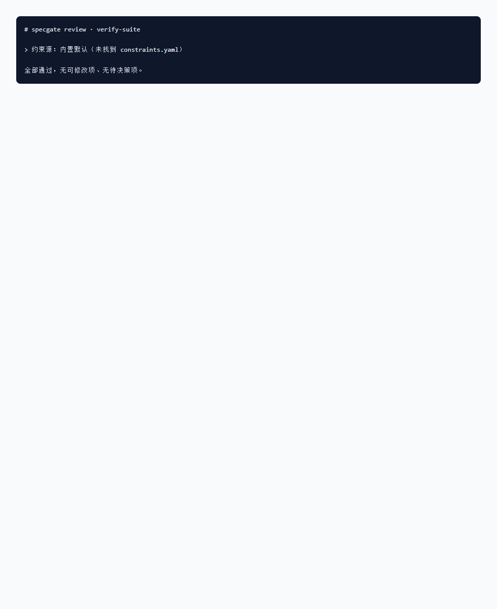

# specgate

[](https://github.com/supernisy/specgate/actions/workflows/test.yml)


一个**纯确定性、零模型参与**的 CLI 门禁：把「提需求的人（不读代码）」的需求，
转成一份「人能审、机器能消费」的验收契约（YAML），并判定契约里每条验收条件
**是否可被机械判定**。契约不合格，不许进入实现阶段。

它**不生成代码、不判断需求合理性**——只做一件事：把「这条验收能不能自动验」说清楚。

## 形状：一个 lint 检查内核 + 两个互斥前门

| | 是什么 | 什么时候用 |
|---|---|---|
| **`lint`**（内核） | 判定契约里每条验收条件能不能被机械判定 | 总是要跑 |
| **`draft`**（前门①） | 从需求文档起草契约（模板 + 提示词） | 没在用 OpenSpec |
| **`bridge`**（前门②） | 把 OpenSpec 的 `spec.md` 确定性解析成契约 | 已经在用 OpenSpec |

> ⚠️ **两个前门互斥，同一份需求只走一条。** 有 `spec.md` 时它就是**唯一需求事实源**，
> 别再 `draft` 一份契约 —— 两个需求源并存必然漂移（改了 spec 忘改 contract），
> 门禁把的到底是哪一份也说不清。

**边界**：specgate **只登记并校验 `verify` 的名称**（在不在清单里），**不执行任何验证工具**，
也**不替代**实现完成后的 `/opsx:verify`（那是「实现 vs 规格」的还原度验证，属另一环；
该斜杠命令属 OpenSpec **扩展 profile**，默认 profile 不含，需 `openspec config profile` 启用）。

> 📌 **三个「验证」别混**：`openspec validate`（CLI）验**格式/结构**写全没有 → specgate `lint` 验**可判定性**（then 能否被机械断言）→ 真正**跑测试**是 `contract-test`/`unit`/`unit-visual`/`trace` 这些**你的测试工具**。
> specgate 只负责中间那一层，并登记第三层的 `verify` 名字。

## 🚀 快速开始（推荐用 Skill，不用记命令）

**你只要做一件事：把需求丢给 specgate。**

- 在对话里输入 **`/specgate`**，或直接说「把需求做成验收契约 / 给需求做门禁 / 审一下验收条件 / 这条能不能被测试验证」
- Skill 会**自动跑完整流程**并把产物生成好，再告诉你怎么用——你不用记任何命令、不用手填 YAML

```
你：  /specgate
你：  （贴一段需求原文，或给个需求文件路径）
specgate → draft 起草 → 填契约(让 AI 按提示逐条转写) → lint 迭代到通过 → plan 切任务包
specgate： 产出 contract.yaml + <契约名>.review.md + specgate-plan/，并告诉你「实现方看 impl-task、测试方看 test-task」
```

**Skill 自动替你跑的四步：**

1. **起草 `draft`** —— 给需求文档，产出空白契约模板 + 填写提示词（不调模型）
2. **填写契约** —— AI 逐条把需求转成可验验收条目，落在 `contract.yaml`（每条含 `suspect` 标注）
3. **门禁 `lint`** —— 十一项检查判定每条能否被机械判定；不通就给 `<契约名>.review.md` 改写建议，迭代到通过（退出码 0）
4. **切任务包 `plan`** —— 产出 `impl-task/`（实现方）与 `test-task/`（测试方）两个物理隔离的任务包

**需求已经在 OpenSpec 里？不用重抄。** Skill 会走桥接路线：`bridge` 一条命令把 `spec.md` 转成契约，再进门禁 —— 见下方「桥接 OpenSpec」。

> ⚠️ Skill 是**你主动触发**的：不自动运行。它只编排流程，**不改** specgate 工具本身的算法（判据/词表/不变量）。
> 想直接敲命令行也完全可以——见下方「四个子命令」，那是 Skill 自动化的同一套命令。

**第一次用 Skill 会自动装好工具**：Skill 自带 `skill/scripts/ensure_specgate.mjs`，按需从 `github.com/supernisy/specgate` 克隆并装好唯一依赖（`yaml`，Node 22+），你无需提前准备。

---

## 三条不可破的设计立场

1. **lint 纯确定性**：不调任何模型，词表/正则/映射表全部写死在源码或 `constraints.yaml`。
2. **误报比漏报严重**：宁可少拦，勿误报。主观词判定 = 命中主观词 **且** 无可测量锚点。
3. **工具不替人决策**：把判断变成需人签字的条目（breaks.approved、assumed_output）。

## 四个子命令（手动用法；Skill 会自动编排这四条，你只要说明需求从哪来）

```bash
# 1. draft（前门①）：给一份需求文档，产出空白契约模板 + 填写提示词（不调模型）
#    与 bridge 互斥 —— 没在用 OpenSpec 才走这条
specgate draft <requirement.md>
#   产出：contract.draft.yaml  contract.template.yaml  draft.prompt.md

# 2. lint（内核）：十一项检查，终端摘要 + 输出 <契约名>.review.md
specgate lint <contract.yaml>
#   退出码：0 通过 · 2 不通过 · 1 用法/IO 错误
#   review 落在契约旁边、按契约命名：contract.yaml → contract.review.md
#   约束源降级为 builtin 时，stderr 告警 + review 顶部横幅（本次通过 ≠ 项目约束下通过）

# 3. plan：产出 impl-task/ 与 test-task/ 两个【物理隔离】的任务包
specgate plan <contract.yaml>
#   隔离自检：从 impl/context.md 提取源码路径，在 test-task 全部文件里搜，
#   命中即失败（退出码 2）。context.md 只在首次生成，已存在则保留，
#   实现方填完真实路径后重跑 plan 才做隔离自检。

# 4. bridge（前门②）：OpenSpec spec.md → contract.yaml（确定性解析，不调模型）
#    与 draft 互斥 —— 已有 spec.md 就只走这条
specgate bridge <spec.md> [out.yaml] [--keep-verify]
#   把 OpenSpec 的 Requirement/Scenario（**WHEN**/**THEN**/**AND**）转成验收契约；
#   verify 用关键词启发式从合法取值推断，并标 verify_source=inferred；
#   suspect / invariants 故意留空，由 AI 在补全阶段填好后，再跑 `specgate lint` 进门禁。
#   --keep-verify：旧契约里人工改过的 verify 保留（标 explicit），其余仍走机器推断。
```

> 位置参数，不用 flag。所有命令的第二个位置参数就是文件路径（`bridge` 的 `--keep-verify` 是唯一例外）。

## 30 秒最小 demo · 看门禁怎么拦

把一份 invariants 写得全是「输出不为空」「退出码应当是整数」的契约喂给 specgate:

```bash
node src/cli.js lint <契约文件>     # → 退出码 2，<契约名>.review.md 列出每处修改建议
node src/cli.js lint <合规契约>     # → 退出码 0，<契约名>.review.md 写着「全部通过」
```


*`review` 文件实际长这样 —— 每条拦截都给出五类可套用句式(增量关系 / 幂等性 / 单调性 / 可加性 / 对称性)。*

按上图建议把恒真废话改成蜕变关系后再跑一次,门禁通过:


*`review` 文件显示「全部通过」—— 契约可进入实现阶段。*

最关键的两条拦下理由(在 FAIL 图里可直接看到):

- **⑥ invariants 有效(判据二)**:`「采集结果始终是数字类型」` —— 这是**恒真废话**,写成测试永远通过,等于没测。specgate 要求 invariants 必须描述**输入变了结果怎么变**(蜕变关系)。
- **措辞可判定性(判据一)**:主观词 + 无锚点必拦;有锚点放行。两级化(`suspect` 标注 + 词表兜底)互不重叠。

> 字面一致 ≠ 判定一致。`invariant.js` 用的是固定词表(`src/words.js`)做字符串匹配 —— 词表外的动词(如"收窄/放宽")会被漏判,要写到词表里才会被拦。详见 §10「实现约束」。

演示素材见 [verify-suite/acceptance/contract-bad.yaml](https://github.com/supernisy/verify-suite/blob/main/acceptance/contract-bad.yaml)(故意写坏的契约,跑 lint 出上图)。

## 桥接 OpenSpec（把 OpenSpec 产物自动转成契约）

specgate 的 `draft` 吃「需求文档」、`lint` 吃「契约」，**都不直接吃 OpenSpec 的 `spec.md`**。
`bridge` 就是这段**桥接转换层**：把 OpenSpec 的 `spec.md` 自动转成 `contract.yaml`，再进 `lint` 门禁。

**什么时候值得从 OpenSpec 起步**（而不是直接丢一份需求文档）——命中任一条就该考虑：

- 需求超过 5 条，或一条需求下要分多个场景（正常 / 异常 / 边界）
- 需求会反复增删改，需要留下「加了什么 / 改了什么 / 删了什么」的记录（→ `## ADDED / MODIFIED / REMOVED Requirements`）
- 多人协作，需求要能被不读代码的人 review

已经在用 OpenSpec 的话，下游接上 specgate 就是一条命令的事；还没用也不打紧——`draft` 路线照样出得了门禁结论。

```bash
# 1. 转换（确定性解析，无模型）
specgate bridge path/to/spec.md contract.generated.yaml

#    旧契约里人工改过的 verify 想保住，加 --keep-verify（只保留人真动过的，重复跑幂等）
specgate bridge path/to/spec.md contract.generated.yaml --keep-verify

# 2. 补全（AI 参与）：桥接故意留空的 suspect / invariants 在这里补，不补等着被 lint 拦

# 3. 进门禁（与手写的契约走同一套十一项检查）
specgate lint contract.generated.yaml
```

**映射规则（详见 `AGENTS.md`）**：

| OpenSpec spec.md | contract.yaml |
|---|---|
| `### Requirement: <name>` | 一组 `accept` 条目（`id` = kebab(name)+场景序号） |
| `#### Scenario` + `- **WHEN**` | `when`（其后 `- **AND**` 续到 when） |
| `- **THEN**` + `- **AND**` | `then` |
| `- **GIVEN**` | `given` |
| requirement 描述段 | `given`（无 GIVEN 时）/ `intent` |
| `verify` | OpenSpec 不产出 → 桥接用**关键词启发式**从 `constraints.yaml` 的合法取值中推断（API→`contract-test`、UI→`unit-visual`、状态迁移→`trace`…兜底 `unit`） |
| `## REMOVED Requirements` | `out_of_scope` 列出被移除的需求 |

**`verify_source`**：桥接给每条 `accept` 打标 —— `inferred`（机器推的）/ `explicit`（人改过的）。
检查⑪ 会报出 inferred 占比，提示逐条确认后消除；`--keep-verify` 只保留 `explicit` 那些。

> ⚠️ **桥接 ≠ 全自动**：`bridge` 只做结构搬运——`suspect` **故意留空**（确定性解析无法判断「测试方能否写出断言」），`invariants`/`breaks`/`uses`/`states` 也不臆造（OpenSpec 不产出这些）。这两类必须由 AI 补全后再进门禁，符合「只加严不放宽」。
> 样例见 `test/samples/openspec-spec.md`（含 ADDED/MODIFIED/REMOVED）与生成的 `openspec-contract.yaml`。

## 退出码

| 退出码 | 含义 |
|--------|------|
| `0` | 通过（含仅提醒项） |
| `2` | 不通过（阻塞项未过，或 plan 隔离自检泄漏） |
| `1` | 用法 / IO 错误（文件不存在、YAML 解析失败等） |

## 十一项检查（§6）

| # | 检查 | 分层 | 影响退出码 |
|---|------|------|-----------|
| ① | 结构（必填字段 / id 唯一 / approved 三值 / out_of_scope 非空 / example.kind / states 枚举） | 阻塞 | ✔ |
| ② | verify 合法（取值来自 constraints.yaml，否则 builtin 并标注） | 阻塞 | ✔ |
| ③ | 措辞可判定性（判据一：主观词 / 复合表述 / 恒真断言，同受锚点门控） | 阻塞 | ✔ |
| ④ | breaks 已批准（approved 三值校验） | 阻塞 | ✔ |
| ⑤ | manual 占比 ≤20% | 阻塞 | ✔ |
| ⑥ | invariants 有效（判据二） | 阻塞 | ✔ |
| ⑦ | 计算类条目必须有不变量（THEN 本身是有效蜕变关系也算满足） | 阻塞 | ✔ |
| ⑧ | 期望值已确认（assumed_output ≠ 你说过的 → 归「决策」非「修改」） | 阻塞 | ✔ |
| ⑨ | 能力边界（when+then 拼接匹配） | 提醒 | ✘ |
| ⑩ | 接口状态覆盖（uses.api 非空才查；已声明 N/6 进常驻摘要） | 提醒 | ✘ |
| ⑪ | verify 分布（inferred 占比 / UI 措辞配错非视觉手段） | 提醒 | ✘ |

> 三层划分依据 = **判定确定性程度**，不是重要程度。⑨⑩⑪ 是「人比机器更懂」的部分，只提醒、不阻塞。

## 两个核心判据

- **判据一·措辞可判定性（两级化）**：最终拦下 = `（suspect: true 且无锚点）` **或** `（命中主观词 / 复合表述 / 恒真断言 且无锚点）`。
  - **第一级 `suspect`**：起草时由 AI 逐条标注（这条 then 测试方写不出断言吗？），lint **只读不判**、不调模型；只能加严不能放宽——`suspect: false` 不放行任何东西，词表层照常跑；未声明则与改动前完全一致（向后兼容）。
  - **第二级词表层**：原有兜底层，不可关闭。共三类信号 —— 主观词（中/英）、复合表述、**恒真断言**（不报错 / 是数字类型 / 达到预期 / 正确无误；写成测试永远通过，等于没测）。
  - 锚点补全优先级高于主观词表：中文直角引号「」『』、布尔词（重定向到/移除/加入/包含于/位于）、顺序·集合类（倒序/升序/降序/排序/置顶/置底/去重）、**枚举映射**（`0: Success` 算；`1: 体验良好` 这种给废话编号的不算）、**带扩展名文件路径**、**英文 code 词**、**反引号真标识符**（`` `getUserList()` `` 算；`` `友好` ``、`` `fast` `` 这类伪装不算）。带上下文排除避免误报。
  - ⚠️ 恒真模式表里**刻意不含 `/[不非]空/`** ——「…而非空列表」是可机械判定的布尔断言，误伤它比漏判更糟；测试里有守门用例盯死这点。
- **判据二·蜕变关系有效性（§4.7–4.12）**：must 分段（变动词之后看 tail），切分点**遍历所有**，存在一种切法成立即通过；恒真词（是数字 / 不为空 / 不报错…）放输出侧即废话 → **阻塞**。

## 实测指标（判据一两级化 · 四类样本分开报，详见 `test/measure.mjs` 与 `test/spec.test.mjs`）

| 类 | 样本 | 拦下 / 误报 | 结论 |
|----|------|------------|------|
| A 词表内主观词（suspect 不声明） | 3 | 拦下 3 | PASS |
| B 词表外中文（suspect: true） | 6 | 拦下 6；未声明时放行 6 | PASS |
| C 外语（suspect: true） | 3 | 拦下 3 | PASS |
| D 无数值但可判定（误报测试） | 6 | 误报 0（必须为 0） | PASS |

> 原「漏报 0/16」只用了词表内的词，属自证，已作废；现样本含词表外说法 / 外语 / 可判定无数值三类，缺一类即未验证改动。
> 判据二（蜕变关系）本次未改动：样本 23（有效 11 / 恒真 12），误报 0、漏报 0，PASS。

二轮改动后全量 `node --test`：**37/37 通过**（首轮 26 + 新增 11 条防回归用例）。新增覆盖：
桥接续行保留、四类新锚点与反引号防伪装、恒真断言（含「而非空列表」守门）、
⑪ 只提醒不改退出码、约束逐级查找与降级告警、review 按契约名落盘、`--keep-verify` 幂等、⑦ 放宽边界。

## 实现约束（§10）

- Node 22+ ESM，仅 1 个运行时依赖（`yaml`）。
- 总代码 ≤1200 行（当前 `src/` 约 1084 行）。
- CLI 用位置参数；提示词/模板放 `templates/`；词表写源码 `src/words.js`。
- `verify` 取值从 `constraints.yaml` 读，找不到用内置默认并标 `builtin`，**源码不硬编码枚举**。

## 验收

```bash
node --test            # 跑 test/spec.test.mjs：§9 全部逐条断言 + 两判据实测
node test/measure.mjs  # 打印两判据误报/漏报率
```

## 目录

```
specgate/
  package.json
  AGENTS.md                   # 开发约定与桥接层设计决策（AI 自主落档）
  constraints.yaml            # verify 取值源（可改，不必动代码）
  src/
    cli.js                    # 位置参数分发 + 退出码（draft/lint/plan/bridge）
    bridge.js                 # 桥接层：OpenSpec spec.md → contract.yaml（确定性解析）
    constraints.js            # verify_tools 加载（builtin 兜底，标 builtin）
    checks.js                 # 结构校验（检查①）+ 十一项检查编排 + 三层划分 + 终端/review 渲染
    suggestions.js            # verify→建议映射（§5.2，绝不自动应用）
    draft.js                  # 模板+提示词生成
    plan.js                   # 两任务包 + 隔离自检
    words.js                  # 主观词表 / 变动词 / 关系词 / 恒真词 / 映射表
    criteria/wording.js       # 判据一
    criteria/invariant.js     # 判据二 + 能力边界 + 状态覆盖
  templates/                  # contract.template.yaml / draft.prompt.md / test.prompt.md / verify-tools.md
  test/                       # 样本集 + 故障注入 + 两判据实测
  skill/                      # specgate Skill（/specgate 触发）
    SKILL.md                  # 流程编排定义（用户主动触发）
    scripts/ensure_specgate.mjs # 自举：定位/克隆工具根目录并装依赖
```

## Skill（可选 · 推荐）：用 `/specgate` 一步跑完

本仓库自带一个 **specgate Skill**，把整条流程编排成一次对话即可完成。

**启用方式**（任选其一）：

- 把 `skill/` 目录放进 WorkBuddy 的 skills 目录（用户级 `~/.workbuddy/skills/` 或项目级 `.workbuddy/skills/`），重启后输入 `/specgate` 即可触发；
- 或直接从市场/对话里加载本仓库的 `skill/SKILL.md`。

**它会先判断你的需求从哪来，再选路线：**

| 你的情况 | Skill 走的路线 |
|---|---|
| 丢来一份需求文档 / 一段需求文字 | `draft` → 引导填契约（标 `suspect`）→ `lint` 迭代到通过 → `plan` 切包 |
| 手里已有 OpenSpec 的 `spec.md` | `bridge` 转成契约 → 补全 `suspect`/`invariants` → `lint` → `plan` |
| 条数多 / 场景多 / 要管增删改记录 | 先建议你上 OpenSpec，再走桥接路线（**不采用也没关系**） |

**触发后它会**：自动确保工具可用（首跑 `ensure_specgate.mjs` 会克隆本仓库并 `npm install yaml`）→ 按上表选路线跑完 → 告诉你产物路径和「实现方/测试方分别看哪」。

> Skill 只编排、不改工具算法；它随时可被关掉改用命令行（见「四个子命令」）。要不要触发，由你决定。
